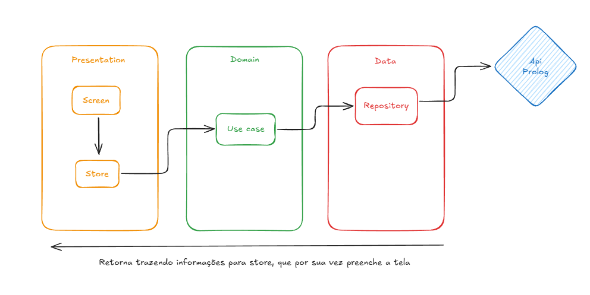
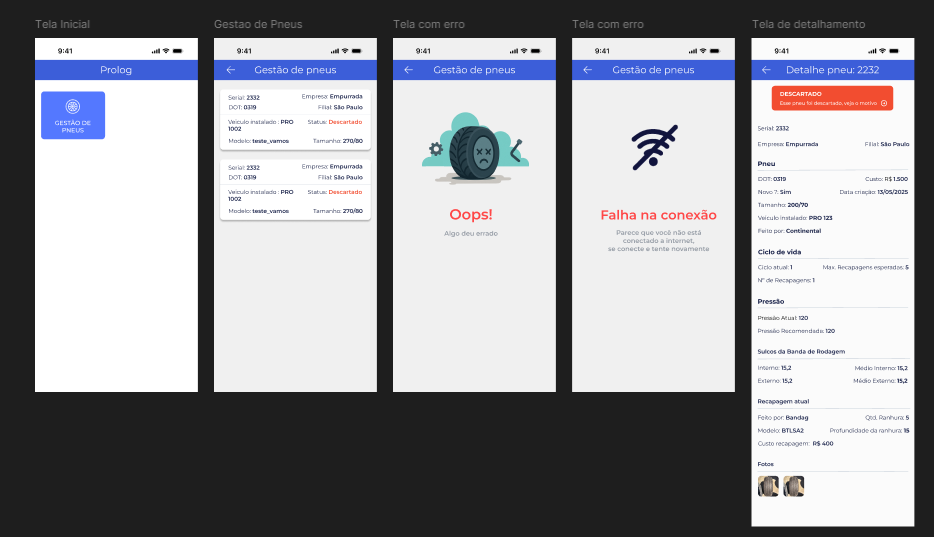

# Prolog App Desafio

## Arquitetura
Arquitetura escolhida: **Clean Architecture** 

**Motivo:** Como a empresa tem um app escalável, desenvolvi o desafio pensando nisso, como se estivesse construindo uma parte real do aplicativo para a empresa. Começando do zero, optei por uma estrutura totalmente escalável e com componentes reutilizáveis. Assim incluir novos módulos no futuro se torna mais simples e fácil. 

É possível ver o desenho da arquitetura aplicada logo abaixo.

Obs: Em uma estrutura ideal, o repository faria a intermediação entre o domain e o data, mas, como é um desafio relativamente pequeno, optei por simplificar e deixar o repository chamando diretamente a API. Fiz isso pra evitar código desnecessário e tornar a leitura do código mais simples e fácil.

## Testes
**TDD (Test-Driven Development)** – Utilizei a metodologia TDD, desenvolvendo os testes com os novos códigos desde o início, garantindo assim cobertura e funcionamento correto das telas e funções.

Foi usado também os pacotes Mockido e Mock Adappter para fazer mocks dos models e chamadas para os testes funcionarem independente da conexão com a internet ou até da API em si.

Para os testes também foi usado as bibliotecas padrão fornecidas pelo próprio Flutter

**Testes feitos:** Unitarios, Widgets e testes de integração

## Tratamento de exceções
Para tratamento de exceções foi usada a própria extensão do DIO, que foi o pacote decidido usar nas chamadas de API. 

Na tabela a seguir é possível ver todas as exceções mapeadas no aplicativo.

| Erros mapeados    | 
| -------- | 
| Erro de conexão - usuário ficar sem internet e afins  | 
| Tempo de conexão esgotado | 
| Tempo de envio excedido    | 
| Tempo de resposta excedido    | 
| Requisição cancelada    | 
| Erro de conexão    | 
| Erros com status code, como 400, 401, 402...    | 

## Desenho do aplicativo
Antes de começar o desenvolvimento, decidi o que seria feito, e como seria feito, para assim que começar já ter tudo na cabeça e facilitar o processo. Nesse processo, criei um protótipo do aplicativo no figma, onde pode ser visto na imagem, e achado através desse [link]

